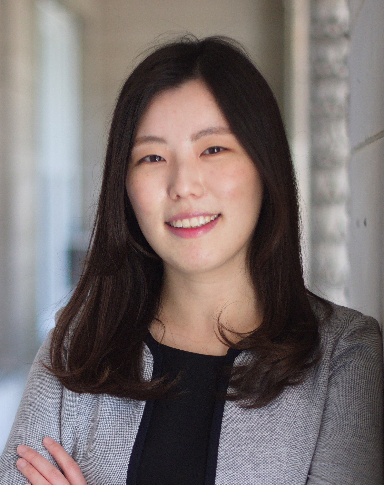

{:style="float: left;margin-right: 20px; margin-top: -5px; max-width: 250px; max-height: 300px;"}

Welcome! 

I am a Research Scientist at Stanford Center at the Incheon Global Campus (SCIGC). 

My primary fields of interest are demography, health economics, and labor economics. More specifically, I study the interactions between socio-economic factors and demographic characteristics, focusing on aspects like fertility and health outcomes.

I earned my Ph.D. in Economics from Michigan State University and my B.S. in Materials Science and Engineering from Hanyang University. 

My CV is available [here](assets/cv/cv_parkn.pdf) (Last Updated: Nov 2025).

Email: [naraepark.econ@gmail.com](mailto:naraepark.econ@gmail.com)
